<!-- configuracion de colores es opcional pero ultil-->
<section id="themes">
	<h2>Configuración de temas</h2>
	

		Temas:  
		<a href="?#/themes">Default</a> -
		<a href="?theme=sky#/themes">Sky</a> -
		<a href="?theme=beige#/themes">Beige</a> -
		<a href="?theme=simple#/themes">Simple</a> -
		<a href="?theme=serif#/themes">Serif</a> -
		<a href="?theme=night#/themes">Night</a>  
		<a href="?theme=moon#/themes">Moon</a> -
		<a href="?theme=solarized#/themes">Solarized</a>
	

</section>

Slide:

# TRASHWARE

Nicolás Gaitán Albarracín

**Ingenio Sin Fronteras**

Slide:

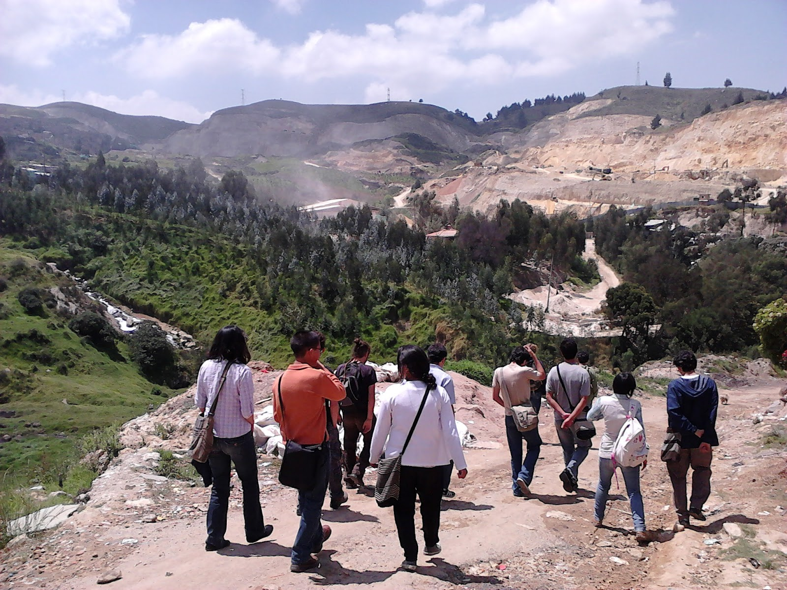

Slide:

# CONTENIDO

## Antecedentes
## Justificación
## Contexto
## Marco Conceptual
## ...

Subslide:

# CONTENIDO
## ...
## Software Libre
## Metodología
## Aprendizajes
## Proyecciones
## Referencias

Slide:
## Antecedentes

Subslide:
## Antecedentes como grupo

* Tunjuelito aguas.
* Shitake Guasca.
* Computadores para educar.
* Jornadas de instalación de SL en la UNAL.

Subslide:
## Antecedentes como proyecto

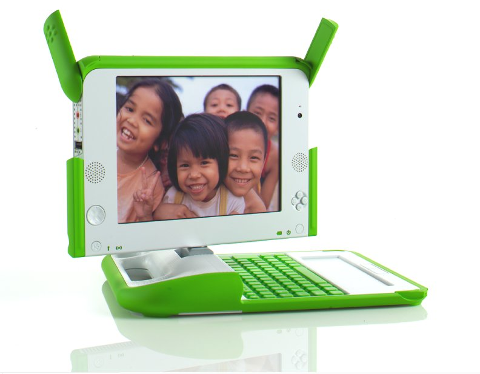

* Computadores para educar.
* One laptop per child.
* Greenetics, tecnología verde para educar - Plan piloto en el colegio Manuela Cañizares, Quito, Ecuador, 2014.

Slide:

## Justificación

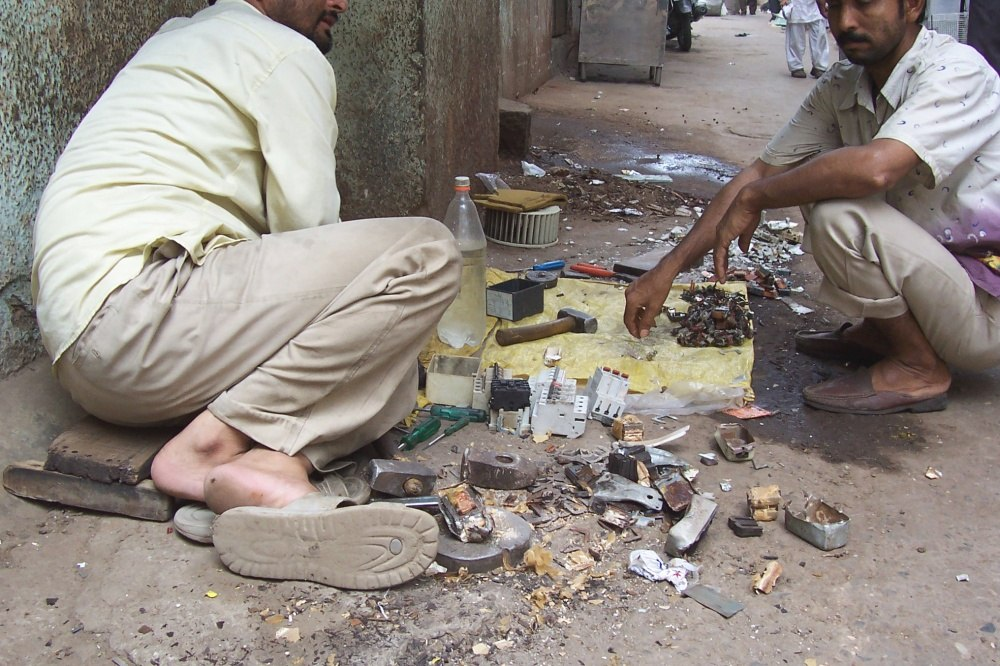

Subslide:

## Justificación

* El uso y el usufructo de herramientas tecnológicas son una alternativa en los procesos de dignificación de la existencia, tanto individual como colectiva, del ser humano en la actualidad.
* Brecha digital.
* Concientización ambiental
* Inclusión tencológica
* Logicas de consumismo.
* Adopción de competencias para el desarrollo personal que le abran nuevos horizontes sociales, académicos y económicos.

Slide:
## Contexto

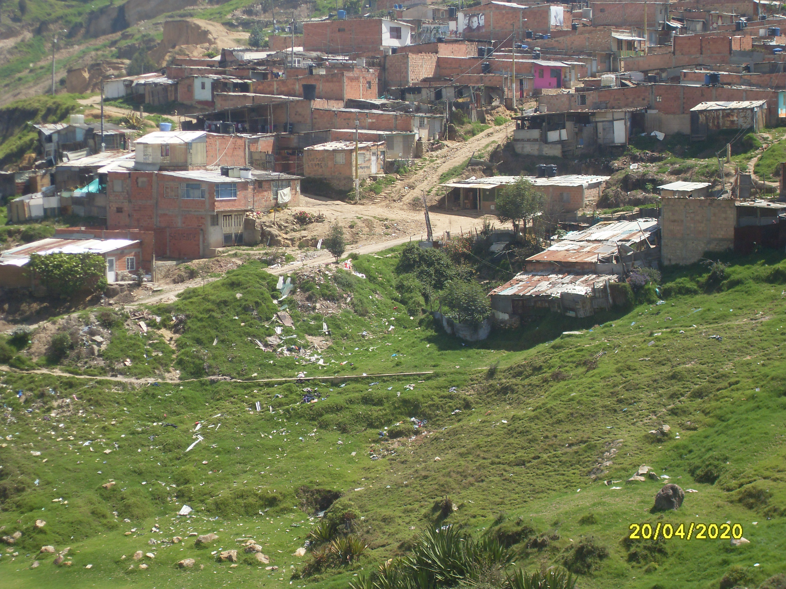

Subslide:
## Contexto

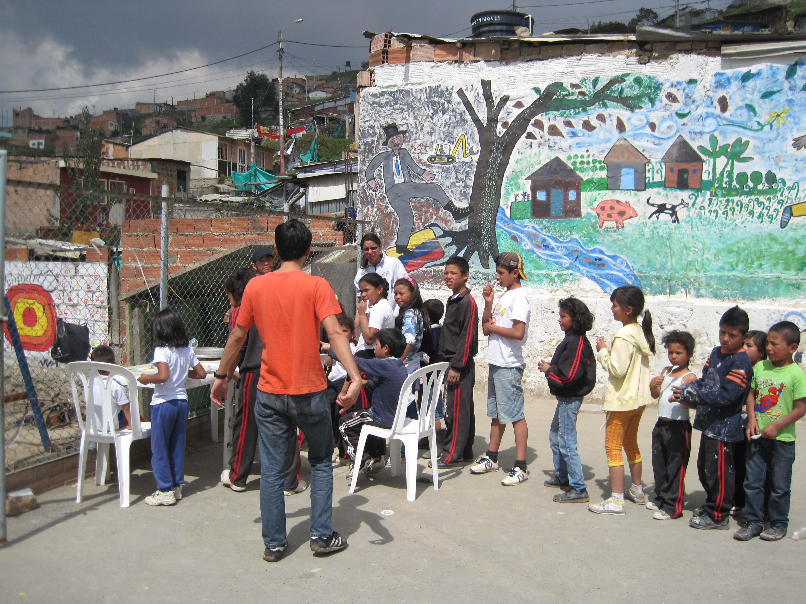

Subslide:
## Contexto
* Altos de Cazuca en el municipio de Soacha.
* Escuela Popular Fe y Esperanza.
* 100 estudiantes y sus familias (aprox.).
* 4 profesores de planta.
* Instalaciones aceptables.
* Acceso limitado a fuentes de agua potable y servicios de slaud.
* Inseguridad alimentaria.
* Deficiente condiciones de saneamiento

Subslide:
## Contexto

* Desplazamiento forzado (+30 años)
* Tolima, Meta, Antioquia, Caquetá, Cundinamarca, Santander.
* Rompimiento de lazos afectivos con su entorno socio espacial.
* Nuevios fenómenos de violencia.

Slide:
# Marco Conceptual

Subslide:
## Brecha digital 

Se define como la separación que existe entre las personas (comunidades, estados, países...) que utilizan las tecnologías de la información y comunicación como una parte rutinaria de su vida diaria y aquéllas que no tienen acceso a las mismas y que aunque las tengan no saben cómo utilizarlas.

Subslide:
## Obsolescencia programada 

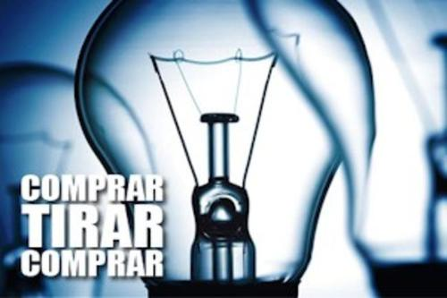

Subslide:
## Obsolescencia programada 
Se refiere al reemplazo de tecnología en periodos cortos de tiempo, gracias a un impulso del mercado orientado al consumo de elementos tecnológicos, específicamente hardware y software.

Subslide:
## E-waste

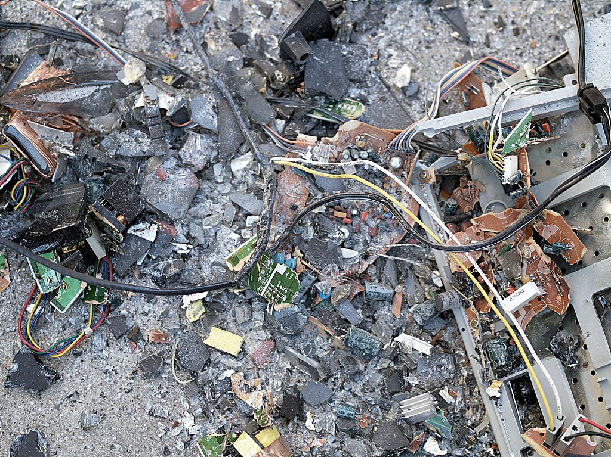

Subslide:
## E-waste

* Consumo compulsivo genera brutales cantidades de desechos cada año, sobre todo de productos electrónicos, lo que se ha dado en llamar “basura electrónica” (e-waste). 

* En enormes pilas se acumulan, muchos de ellos aún funcionando, y son irresponsablemente exportados a países pobres, de África o de Asia.

*Arsenio, cromo, cadmio, berilio, selenio...

Subslide:

## Empoderamiento 

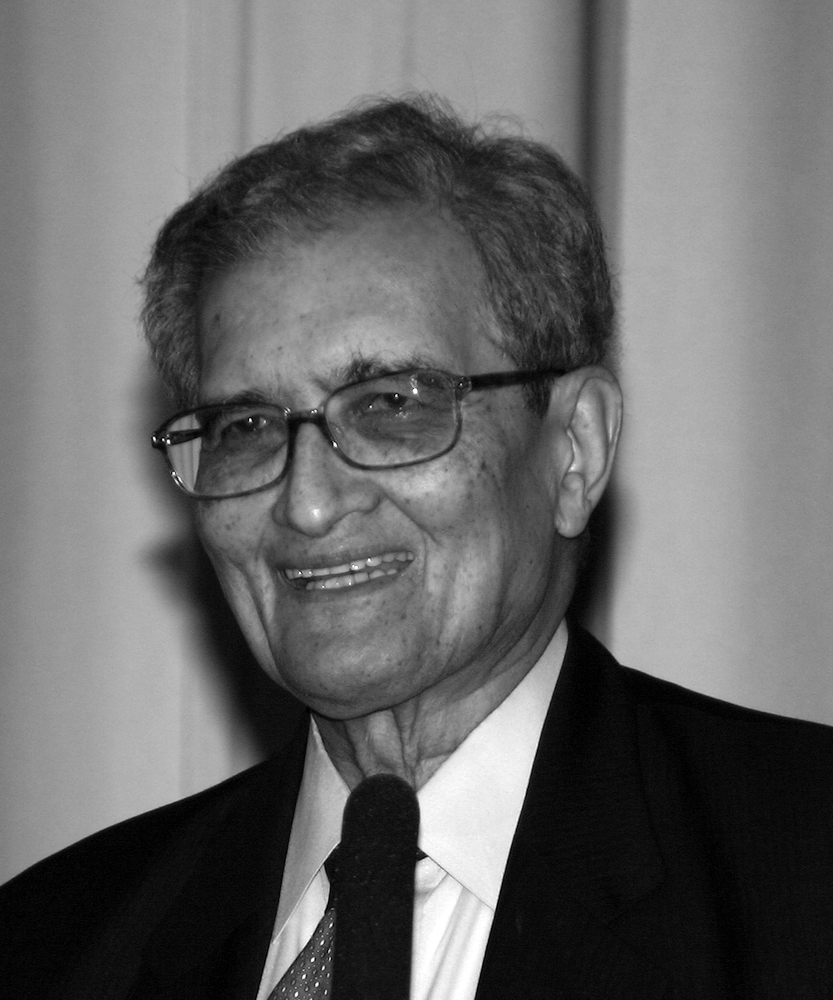

Subslide:

## Empoderamiento 

"Una forma de pensar sobre el empoderamiento es como la capacidad para la autosuficiencia (es decir, lo contrario de la dependencia): "La dependencia de los demás es que no sólo es éticamente problemático, también es prácticamente derrotista en minando la iniciativa y el esfuerzo individual, e incluso auto-respeto. ¿Quién mejor que depender de uno mismo para cuidar de los intereses y los problemas de uno? "(Sen, 2001, p. 283).

Subslide:

## Empoderamiento tecnológico

Subslide:

## Empoderamiento tecnológico

"Sin embargo, es sólo cuando las nuevas tecnologías de la información y de la comunicación facultan a la humanidad con la capacidad incesante para alimentar el conocimiento nuevo en el conocimiento, la experiencia en la experiencia, que no es, al mismo tiempo, el potencial de productividad sin precedentes, y una especialmente estrecha relación entre la actividad de la mente, por una parte, y la producción material, ya sea de bienes o servicios, en el otro '(Castells, 1999, p. 11​​).

Slide:
# Software Libre

Subslide:
## Edubuntu

* Destinada para su uso en ambientes escolares.
* Aplicaciones educativas como GCompris y la KDE Edutainment Suite.

Subslide:
## GCompris

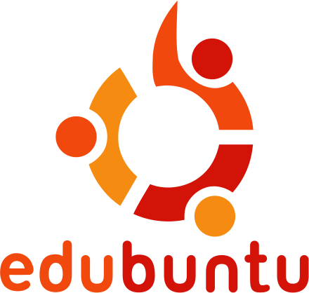

* Actividades para niños entre 2 y 10 años de edad.
* Videojuegos educativos. 
* Iniciarse en el manejo de una computadora.

Subslide:

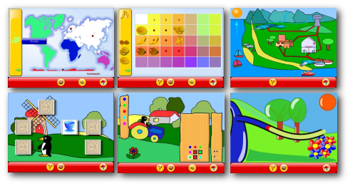

Subslide:
## KDE Edutainment

* Lenguajes: Kanagra,KHangMan, Kiten, KLatin, KLettres, KVerbos 
* Matemáticas. KBruch, Kig, KmPlot, KPercentage.
* Varios: KGeography, KTouch KTurtle, KWordQuiz. 
* Ciencia. Kalzium, KStars. 

Subslide:

 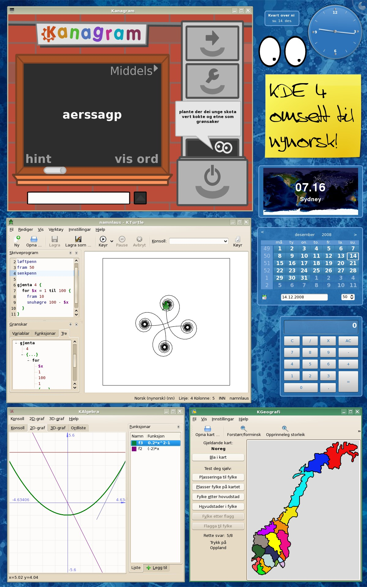

Subslide:
##Canaima

Subslide:
##Canaima

* Proyecto socio-tecnológico abierto, construido de forma colaborativa, centrado en el desarrollo de herramientas y modelos productivos basados en las TIC con SL 
* Sistemas operativos cuyo objetivo es generar capacidades nacionales, desarrollo endógeno, apropiación y promoción del libre conocimiento, sin perder su motivo original.
* Impulsa grandes proyectos nacionales tanto a nivel público como privado, entre los que se encuentran el Proyecto Canaima Educativo, el Plan Internet equipado de CANTV, entre otros.

Subslide:
##Covencionales

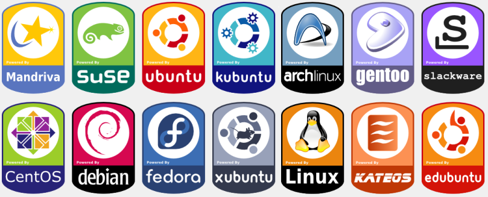

Slide:
## Metodología

* Metametodología.
* Human Centered Design (HCD) 

* Creative Capacity Building (CCB)
La capacidad inherente de las personas a ser solucionadores creativos de sus problemas e instrumentos de su propio progreso.

Slide:
## Aprendizajes

* No se hizo una adecuada gestión del riesgo.
* Multiples dificultades en la ejecución de presupuestos  de la UNAL.
* Excesiva flexibilidad en los contenidos.
* Poca focalización de publico objetivo.
* Ausencia de trans-interdisciplaridad.
* Limitaciones en las ventajas asociadas al SL.
* Baja continuidad de asistentes.

Slide:
## Proyecciones

Diagnostico Actual

* Estado de las instalaciones.
* Estado de los equipos (SO, Software; Hardware, localización, etc).
* Evaluación de stakeholders.
* Nueva convocatoria ainteresados.
* Dinámica social.

Subslide:
## Proyecciones

Diagnostico Actual
* Actores e intereses en la escuela.
* Re-diseño metodológico.
* Recursos disponibles (Guías, presupuesto, RH, etc).
* Generación de línea base y batería de indicadores.
* Evaluación de comunidad objetivo y evalución tecnica de mejor solución de software.

Slide:
## Referencias

* Castro, Mayorga, Vargas Marín.2012. Informe Final “Trashware 2.0”  

* Romero, Martine, Gaitan, Huertas2011.Primera Convocatoria Nacional de Extensión Solidaría Universidad Nacional de Colombia:Apuestas para construir país Proyecto TRASHWARE

* Heinz, F. (2006). ¿Qué tiene que ver Software Libre con educación? In B. Busaniche (Ed.), Prohibido Pensar, Propiedad Privada. Los monopolios sobre la vida, el conocimiento y la cultura. Cordoba: Fundación Via Libre. 

* Martínez , J. H. (2010). La inteligencia de negocios como herramienta para la toma de decisiones estratégicas en las empresas. Análisis de su aplicabilidad en el contexto corporativo colombiano. . Maestría en Administración, Universidad Nacional de Colombia, Bogotá. Retrieved from http://www.bdigital.unal.edu.co/3098/1/940607.2010a.pdf  

* Salgado, A. (2011). Obsolecencia programada, deloberado acto de disenar productos que fallen pronto, incrementar el desperdicio y destruir y envenenar el medio ambiente. , from http://www.argenpress.info/2011/11/obsolescencia-programada-deliberado.html

* Serrano, A., & Martínez, E. (2003). La brecha digital: Mitos y realidades. Baja California: Departamento Editorial Universitaria de la Universidad Autónoma de Baja California.

